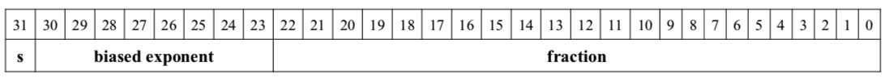
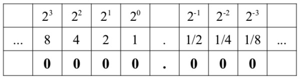

#### 整型表示
- 无符号整型: 值为存储大小的范围.
- 有符号整型: 值以二进制补码存储two's complement,准确说负数以二进制补码存储.

> 二进制补码：
> 1. 取反
> 2. 加1
>
> 此处理同样适用于十进制与二进制补码相互转换

| 无符号加法 | |
| :---: | :---: |
| 241 | 11110001 |
| +7  | 00000111 |
| 248 | 11111000 |
| 248=| F8 |

| 有符号加法 | |
| :---: | :---: |
| -15 | 11110001 |
| +7  | 00000111 |
| -8  | 11111000 |
| -8= | F8 |

#### 浮点数表示
> 采用IEEE 754 32-bit floating-point standard

^s\times1.F\times2^{E-127})
> `s`(正数为0,负数为1), 偏置指数(biased exponent)等于二进制串以科学计数表示时2的指数加127.
>
> 如-7.75的二进制表示-0111.11,科学计数表示为1.1111 x pow(2,2) (因为小数点前移了2位)。
> 指数为2,则偏置指数为127+2=129,即二进制10000001. 最终以32位二进制表示为1100 0000 1111 1000 0000 0000 0000 0000
> 即 C0F8 0000
>
> -0.125二进制表示-0.001,科学计数表示1.0 x pow(2,-3),偏置指数为-3+127=124,二进制表示01111100,
> 最终32位二进制表示1011 1110 0000 0000 0000 0000 0000 0000,即 BE00 0000

二进制100.101表示十进制4.625:
