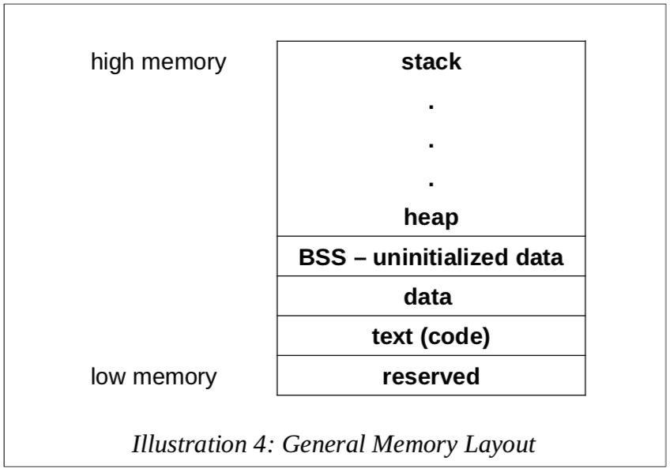
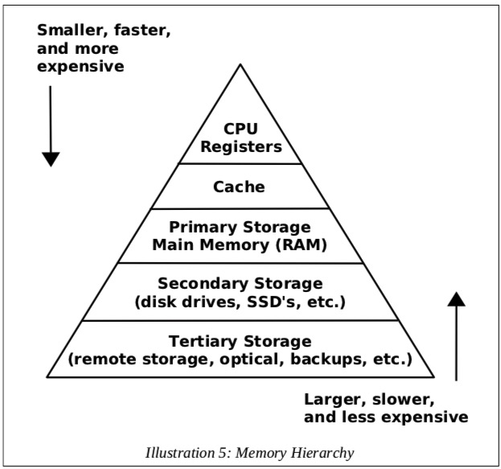

### 缓冲内存Cache Memory

### 主内存Main Memory
> 小端字节序(*little-endian* Least Significant Byte LSB)

#### 内存布局

- 保留段: 程序不可访问
- 文本(代码)段: 保存机器码
- 数据段: 汇编时定义了初始值的变量
- BSS段: 未给初始值的变量

#### 内存层级Memory Hierarchy

- 寄存器: 16,64bit, ~1纳秒
- 缓冲内存: 4-8M, ~50-60纳秒
- 主存: 2-32G, ~100-150纳秒
- 二级存储: 500G-4T, ~3-15毫秒
> 纳秒nanosecond(pow(10,-9)), 毫秒millisecond(pow(10,-3))
